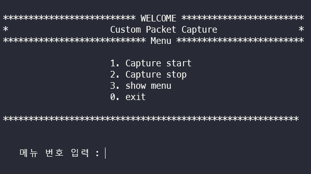
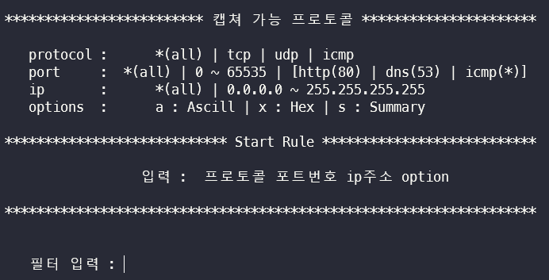
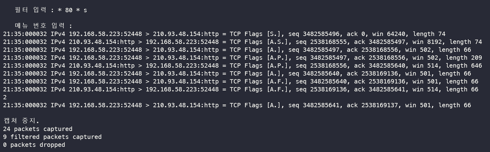

# 컴퓨터 네트워크 과제 ( raw socket 이용하여 packet capture prgram 만들기 )

### 개발 환경 : Linux Ubuntu 20.04 (wsl2) / C / vscode

### 동작 환경 : Linux / cli

<br>

raw socket을 이용한 `tcpdump`를 모방하는 캡쳐 프로그램 작성

<br>

IPv4를 기반으로 2계층인 Ethernet 정보부터 패킷을 수집하여 앞에서부터 잘라내면서, Ethernet header | ip header | TCP/UDP/ICMP header | data(payload) 캡쳐 하는 프로그램

_그 외 프로토콜도 캡쳐가능하나 과제 조건대로 tcp/udp/icmp만 필터링하여 캡쳐_

<br>

## 사용방법 
Makefile 이용하여 `make`로 컴파일 후 프로그램을 `sudo`권한으로 실행시키면 된다.

```
1. make로 compile
2. sudo ./captureProgram 실행
```

요약내용은 command에 표시되며, 상세 내용은 자동으로 .txt파일에 저장된다.

<br>

start 시 `protocol port ip options` 순으로 입력하여 실행.

- **protocol** :
  - \* (all ) : tcp / udp / icmp 프로토콜 캡쳐
  - tcp : tcp 프로토콜 캡쳐
  - udp : udp 프로토콜 캡쳐
  - icmp : icmp 프로토콜 캡쳐
- **port** :
  - \* (all) : 0~65535 모든 포트번호 캡쳐
  - 0~65535 입력 [ http : 80 / dns : 53 ]
- **ip** :
  - \* (all ) : 0.0.0.0 ~ 255.255.255.255 모든 ip주소 캡쳐
  - 0.0.0.0 ~ 255.255.255.255 입력 [ localhost : 127.0.0.1 ]
- **options** :
  - s : 캡쳐 패킷 data 요약내용으로 출력
  - a : 캡쳐 패킷 data ascii로 출력
  - x : 캡쳐 패킷 data hex로 출력

<br>

## 실행 화면
<br>

### ◼ 초기 메뉴



<br>

### ◼ start 화면 (filter 입력)



<br>

### ◼ s 옵션으로 http(80번 포트) 패킷 캡쳐



<br>

### ◼ a 옵션으로 http(80번 포트) 패킷 캡쳐

```
 필터 입력 : * 80 * a

   메뉴 번호 입력 :
21:36:000040 IPv4 192.168.58.223:52450 > 210.93.48.154:http = TCP Flags [S.], seq 3552056342, ack 0, win 64240, length 74
E..<..@.@.v-..:..]0.
...P.......................
1:..........

21:36:000040 IPv4 210.93.48.154:http > 192.168.58.223:52450 = TCP Flags [A.S.], seq 3782798306, ack 3552056343, win 8192, length 74
E..<H.@.x....]0...:.
.P...x........ ................
..~c1:..

21:36:000040 IPv4 192.168.58.223:52450 > 210.93.48.154:http = TCP Flags [A.], seq 3552056343, ack 3782798307, win 502, length 66

21:36:000040 IPv4 192.168.58.223:52450 > 210.93.48.154:http = TCP Flags [A.P.], seq 3552056343, ack 3782798307, win 502, length 209
E.....@.@.u...:..]0.
...P.....x.......4.....
1:....~c
GET / HTTP/1.1
User-Agent: Wget/1.20.3 (linux-gnu)
Accept: */*
Accept-Encoding: identity
Host: eclass.kpu.ac.kr
Connection: Keep-Alive

E..4..@.@.v4..:..]0.
...P.....x.............
1:....~c

21:36:000040 IPv4 210.93.48.154:http > 192.168.58.223:52450 = TCP Flags [A.P.], seq 3782798307, ack 3552056486, win 514, length 646
E..xH.@.x..>.]0...:.
.P...x.................
..~d1:..
HTTP/1.1 200 OK
Content-Type: text/html
Last-Modified: Sat, 28 Mar 2015 20:50:27 GMT
Accept-Ranges: bytes
ETag: "66f35cd29869d01:0"
Server: Microsoft-IIS/7.5
X-Powered-By: ASP.NET
Date: Tue, 0
21:36:000040 IPv4 192.168.58.223:52450 > 210.93.48.154:http = TCP Flags [A.], seq 3552056486, ack 3782798887, win 501, length 66
E..4..@.@.v2..:..]0.
...P.....x.'...........
1:....~d
3 Nov 2020 12:36:18 GMT
Content-Length: 333

<!DOCTYPE html PUBLIC "-//W3C//DTD HTML 4.01 Transitional//EN" "http://www.w3.org/TR/html4/loose.dtd">
<html>
<head>
<meta http-equiv="Content-Type" content="text/html; charset=utf-8">
<title>...........................</title>
<script>
document.location.href="/ilos/index.acl";
</script>
</head>
<body>

</body>
</html>
21:36:000040 IPv4 192.168.58.223:52450 > 210.93.48.154:http = TCP Flags [A.F.], seq 3552056486, ack 3782798887, win 501, length 66
E..4..@.@.v1..:..]0.
...P.....x.'...........
1:....~d

21:36:000040 IPv4 210.93.48.154:http > 192.168.58.223:52450 = TCP Flags [A.F.], seq 3782798887, ack 3552056487, win 514, length 66
E..4H.@.x...]0...:.
.P...x.'........g......
..~e1:..

21:36:000040 IPv4 192.168.58.223:52450 > 210.93.48.154:http = TCP Flags [A.], seq 3552056487, ack 3782798888, win 501, length 66
E..4..@.@.v0..:..]0.
...P.....x.(...........
1:....~e

```

<br>

### ◼ x 옵션으로 http(80번 포트) 패킷 캡쳐

```
필터 입력 : * 80 * x

   메뉴 번호 입력 :
21:39:000042 IPv4 192.168.58.223:52454 > 210.93.48.154:http = TCP Flags [S.], seq 985118399, ack 0, win 64240, length 74
 45 00 00 3C 76 FC 40 00 40 06 C5 40 C0 A8 3A DF D2 5D 30 9A
 CC E6 00 50 3A B7 B6 BF 00 00 00 00 A0 02 FA F0 FE AD 00 00 02 04 05 B4 04 02 08 0A 31 3D 96 53 00 00 00 00 01 03 03 07

21:39:000042 IPv4 210.93.48.154:http > 192.168.58.223:52454 = TCP Flags [A.S.], seq 2133158606, ack 985118400, win 8192, length 74
 45 00 00 3C 7B E2 40 00
21:39:000042 IPv4 192.168.58.223:52454 > 210.93.48.154:http = TCP Flags [A.], seq 985118400, ack 2133158607, win 502, length 66
 45 78 00 00 34 76 FD 40 00 40 06 C5 47 C0 A8 3A DF D2 5D 30 9A
 CC E6 00 50 3A B7 B6 C0 7F 25 6A CF 80 10 01 F6 FE A5 00 00 01 01 08 0A 31 3D 96 58 07 1E C5 27

21:39:000042 IPv4 192.168.58.223:52454 > 210.93.48.154:http = TCP Flags [A.P.], seq 985118400, ack 2133158607, win 502, length 209
 45 00 00 C3 76 FE 40 00 40 06 C4 B7 C0 A8 3A DF D2 5D 30 9A
 CC E6 00 50 3A B7 B6 C0 7F 25 6A CF 80 18 01 F6 FF 34 00 00 01 01 08 0A 31 3D 96 58 07 1E C5 27
 47 45 54 20 2F 20 48 54 54 50 2F 31 2E 31 0D 0A 55 73 65 72 2D 41 67 65 6E 74 3A 20 57 67 65 74 2F 31 2E 32 30 2E 33 20 28 6C 69 6E 75 78 2D 67 6E 75 29 0D 0A 41 63 63 65 70 74 3A 20 2A 2F 2A 0D 0A 41 63 63 65 70 74 2D 45 6E 63 6F 64 69 6E 67 3A 20 69 64 65 6E 74 69 74 79 0D 0A 48 6F 73 74 3A 20 65 63 6C 61 73 73 2E 6B 70 75 2E 61 63 2E 6B 72 0D 0A 43 6F 6E 6E 65 63 74 69 6F 6E 3A 20 4B 65 65 70 2D 41 6C 69 76 65 0D 0A 0D 0A 06 88 5A D2 5D 30 9A C0 A8 3A DF
 00 50 CC E6 7F 25 6A CE 3A B7 B6 C0 A0 12 20 00 EC F6 00 00 02 04 05 B4 01 03 03 08 04 02 08 0A 07 1E C5 27 31 3D 96 53

21:39:000042 IPv4 210.93.48.154:http > 192.168.58.223:52454 = TCP Flags [A.P.], seq 2133158607, ack 985118543, win 514, length 646
 45 00 02 78 7B EA 40 00 78 06 86 16 D2 5D 30 9A C0 A8 3A DF
 00 50 CC E6 7F 25 6A CF 3A B7 B7 4F 80 18 02 02 97 E2 00 00 01 01 08 0A 07 1E C5 27 31 3D 96 58
 48 54 54 50 2F 31 2E 31 20 32 30 30 20 4F 4B 0D 0A 43 6F 6E 74 65 6E 74 2D 54 79 70 65 3A 20 74 65 78 74 2F 68 74 6D 6C 0D 0A 4C 61 73 74 2D 4D 6F 64 69 66 69 65 64 3A 20 53 61 74 2C 20 32 38 20 4D 61 72 20 32 30 31 35 20 32 30 3A 35 30 3A 32 37 20 47 4D 54 0D 0A 41 63 63 65 70 74 2D 52 61 6E 67 65 73 3A 20 62 79 74 65 73 0D 0A 45 54 61 67 3A 20 22 36 36 66 33 35 63 64 32 39 38 36 39 64 30 31 3A 30 22 0D 0A 53 65 72 76 65 72 3A 20 4D 69 63 72 6F 73 6F 66 74 2D 49 49 53 2F 37 2E 35 0D 0A 58 2D 50 6F 77 65 72 65 64 2D 42 79 3A 20 41 53 50 2E 4E 45 54 0D 0A 44 61 74 65 3A 20 54 75 65 2C 20 30 33 20 4E 6F 76 20 32 30 32 30 20 31 32 3A 33 39 3A 31 39 20 47 4D 54 0D 0A 43 6F 6E 74 65 6E 74 2D 4C 65 6E 67 74 68 3A 20 33 33 33 0D 0A 0D 0A 3C 21 44 4F 43 54 59 50 45 20 68 74 6D 6C 20 50 55 42 4C 49 43 20 22 2D 2F 2F 57 33 43 2F 2F 44 54 44 20 48 54 4D 4C 20 34 2E 30 31 20 54 72 61 6E 73 69 74 69 6F 6E 61 6C 2F 2F 45 4E 22 20 22 68 74 74 70 3A 2F 2F 77 77 77 2E 77 33 2E 6F 72 67 2F 54 52 2F 68 74 6D 6C 34 2F 6C 6F 6F 73 65 2E 64 74 64 22 3E 0D 0A 3C 68 74 6D 6C 3E 0D 0A 3C 68 65 61 64 3E 0D 0A 3C 6D 65 74 61 20 68 74 74 70 2D 65 71 75 69 76 3D 22 43 6F 6E 74 65 6E 74 2D 54 79 70 65 22 20 63 6F 6E 74 65 6E 74 3D 22 74 65 78 74 2F 68 74 6D 6C 3B 20 63 68 61 72 73 65 74 3D 75 74 66 2D 38 22 3E 0D 0A 3C 74 69 74 6C 65 3E ED 95 9C EA B5 AD EC 82 B0 EC 97 85 EA B8 B0 EC 88 A0 EB 8C 80 ED 95 99 EA B5 90 3C 2F 74 69 74 6C 65 3E 0D 0A 3C 73 63 72 69 70 74 3E 20 0D 0A 64 6F 63 75 6D 65 6E 74 2E 6C 6F 63 61 74 69 6F 6E 2E 68 72 65 66 3D 22 2F 69 6C 6F 73 2F 69 6E 64 65 78 2E 61 63 6C 22 3B 0D 0A 3C 2F 73 63 72 69 70 74 3E 0D 0A 3C 2F 68 65 61 64 3E 0D 0A 3C 62 6F 64 79 3E 0D 0A 0D 0A 3C 2F 62 6F 64 79 3E 0D 0A 3C 2F 68 74 6D 6C 3E

21:39:000042 IPv4 192.168.58.223:52454 > 210.93.48.154:http = TCP Flags [A.], seq 985118543, ack 2133159187, win 501, length 66
 45 00 00 34 76 FF 40 00 40 06 C5 45 C0 A8 3A DF D2 5D 30 9A
 CC E6 00 50 3A B7 B7 4F 7F 25 6D 13 80 10 01 F5 FE A5 00 00 01 01 08 0A 31 3D 96 5D 07 1E C5 27

21:39:000042 IPv4 192.168.58.223:52454 > 210.93.48.154:http = TCP Flags [A.F.], seq 985118543, ack 2133159187, win 501, length 66
 45 00 00 34 77 00 40 00 40 06 C5 44 C0 A8 3A DF D2 5D 30 9A
 CC E6 00 50 3A B7 B7 4F 7F 25 6D 13 80 11 01 F5 FE A5 00 00 01 01 08 0A 31 3D 96 5E 07 1E C5 27

21:39:000042 IPv4 210.93.48.154:http > 192.168.58.223:52454 = TCP Flags [A.F.], seq 2133159187, ack 985118544, win 514, length 66
 45 00 00 34 7C 05 40 00 78 06 88 3F D2 5D 30 9A C0 A8 3A DF
21:39:000042 IPv4 192.168.58.223:52454 > 210.93.48.154:http = TCP Flags [A.], seq 985118544, ack 2133159188, win 501, length 66
 45
 00 50 CC E6 7F 25 6D 13 3A B7 B7 50 80 11 02 02 36 E1 00 00 01 01 08 0A 07 1E C5 28 31 3D 96 5E
 00 00 34 77 01 40 00 40 06 C5 43 C0 A8 3A DF D2 5D 30 9A
 CC E6 00 50 3A B7 B7 50 7F 25 6D 14 80 10 01 F5 FE A5 00 00 01 01 08 0A 31 3D 96 B1 07 1E C5 28
```
